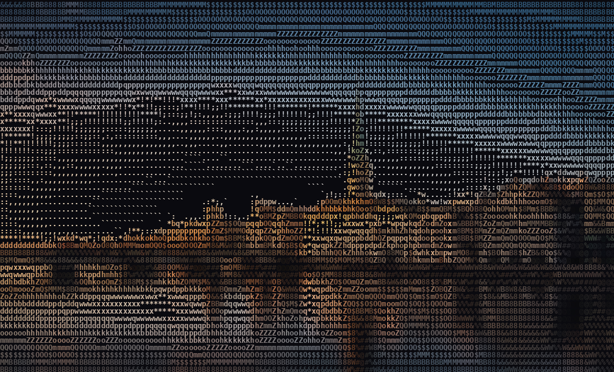

<h1 align="center">Hi👋 Welcome to Ishaaq's GitHub Profile 🤓</h1>

I am Ishaaq, a Developer Relations Engineer and Technical Marketer specializing in Rust-based ecosystems.  I turn protocol complexity, think RWA tokenization, compliant DeFi, and L1 infrastructure upgrades, into developer trust and measurable community growth. 3x hackathon winner, DevRel Uni scholar (1 of 60 selected globally, Arbitrum-backed), and 1st Place winner at the University of Zürich's Blockchain Summer School.  Graduated with Honors from the British Computer Society with a Professional Graduate Diploma in IT, and with 2nd Upper Honors from London Metropolitan University with a BEng in Computer Network & Cloud Security.  I am on a mission to reignite the internet via true DX.  ✨ Creating bugs since 2021 🎯 Goals: Pioneering the Internet through developer education  🎲 Fun fact: I love pizza 🍕

  
  
  
  
  
  
  
  
  
  
  
  
  
  
  
  
  
  
  
  
  
  
  
  
  
  
  
  
  
  
  
  
  
  
  
  
  
  
  

###

  
  

###

  

###

<picture>
  <source media="(prefers-color-scheme: dark)" srcset="https://raw.githubusercontent.com/ishaaqziyan/ishaaqziyan/output/pacman-contribution-graph-dark.svg">
  <source media="(prefers-color-scheme: light)" srcset="https://raw.githubusercontent.com/ishaaqziyan/ishaaqziyan/output/pacman-contribution-graph.svg">
  
</picture>

<!-- gitarmy-wallet:v1 {"chain":"solana","address":"FTpzNouDULJGCELYyzkkngEcytSZmS6FoSWCiBiFC1rf"} -->
###
